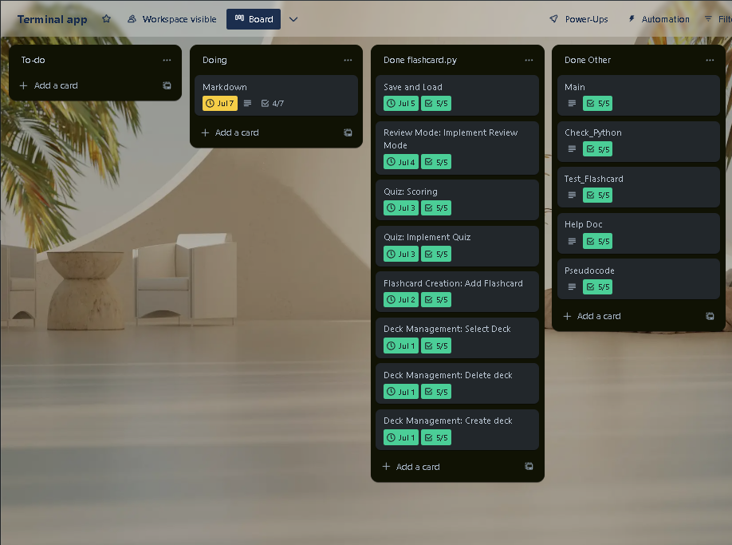
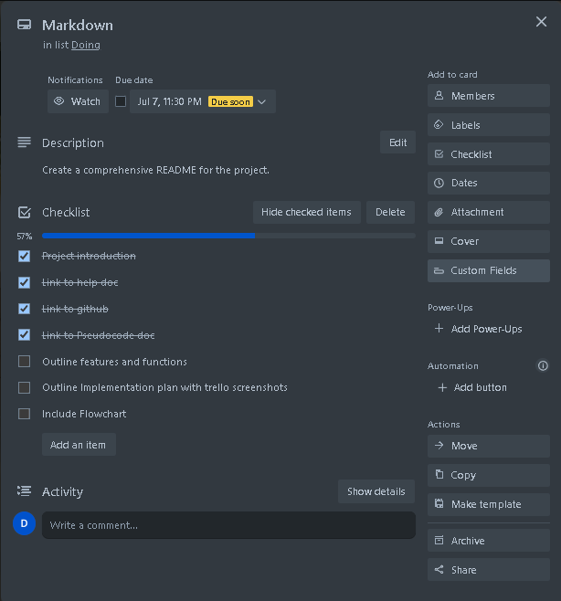
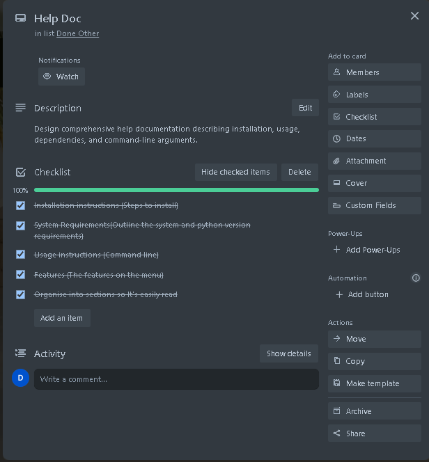
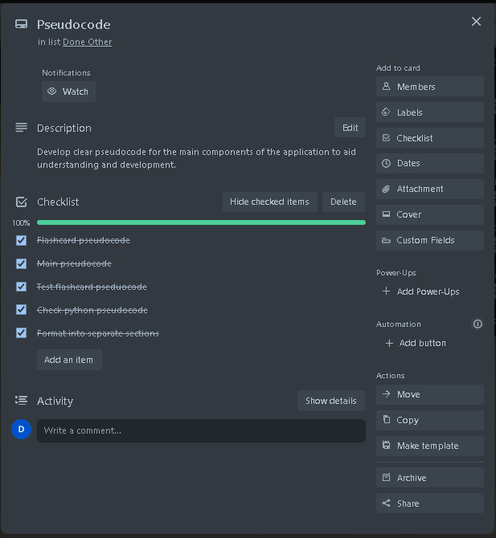
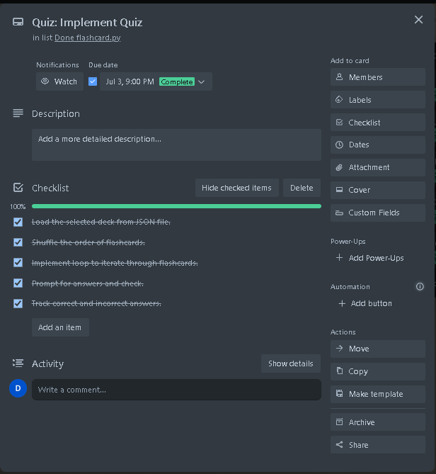

# T1A3-Terminal_application

## General Documentation

- Title: Flashcard Terminal Application
- Author: Luke Harris
- End Date: 07/07/2024

## Help Documentation

- [Link to help doc](./docs/Help%20Doc/help_documentation.md)

## Pseudocode Document

- [Link to pseudocode doc](./docs/pseudocode/pseudocode.md)

## Source Control Repository

- [Link to Github Repository](https://github.com/LukeZHar/T1A3-Terminal_application)

## Code Style Guide

- Code Style PEP 8 - Style guide for Python Code
  - [Link to PEP 8 Reference website](https://peps.python.org/pep-0008/)

## Project Overview

This terminal application allows you to create and manage flashcards through the command line and then quiz yourself on the questions you provided.

### Summary of code and files

- 'flashcards.py':

  - Defines classes 'Flashcard', 'Deck', and 'DeckManager' for managing flashcards and decks.
  - 'DeckManager' includes methods for creating and deleting, saving, loading decks, and running a quiz.
  - Includes error handling for file operations.

- 'main.py':

  - Contains the main loop for the interface, allowing you to interact with the flashcard system
  - Handles creating, deleteing, selecting decks, adding/viewing flashcards, and running the quiz
  - Ensures error handling for unexpected issues.

- 'test_flashcard.py':

  - Contains tests for the 'Deck' and 'DeckManager' classes using pytest

- 'check_python.py':

  - Uses a command ('python' or 'python3') as an argument to check if its installed
  - Prints the version if it was successful
  - Handles exceptions if command is not found or other errors occur

- 'decks.json'

  - A JSON file containing data for decks and flashcards

- 'requirements.txt':

  - Lists dependecies required by the application

- 'run_setup.sh:

  - A shell script for checking if python is downloaded through 'check_python.py', downloading the denpendices from 'requirements.txt' if not installed already, and running the 'test_flashcard.py' tests

- 'run_app.sh':
  - A shell script for running the application, including activating the virtual environment if it exists

## Features and Functions of the application

### Deck Management

#### Create Deck:

- Description: Create a new deck. Input the deck name, verified to avoid duplicates, and then saves as a new JSON file.

- Logic:
  - Prompts for a deck name.
  - Check if the deck name already exists.
  - If it does not exist, create a new JSON file for the deck.
  - If it does exist, asks for a different name.

#### Delete Deck:

- Description: Delete an existing deck by specifying its name.

- Logic:
  - Prompts for the deck name.
  - Check if the deck exists in the directory.
  - If it exists, delete the JSON file.
  - If it does not exist, prompts name doesnt exist.

#### Select Deck

- Description: Select a deck to perform operations.

- Logic:
  - List all available decks.
  - Prompt to choose a deck by number.
  - Validates input and sets the current deck.

### Flashcard Add and view

- Description: Add new flashcards to the selected deck by providing a question and an answer. You can also choose to view current flashcards in your deck

- Logic:
  - Prompts for a question and an answer.
  - Load the current deck from its JSON file.
  - Adds the new flashcard to the deck.
  - Save the updated deck back to the JSON file.
  - Loads current flashcards in deck

### Quiz Mode

- Description: Shuffles flashcards then quizzes you, keeping track of correct and incorrect responses.

- Logic:
  - Load the selected deck.
  - Shuffle the order of flashcards.
  - Loop through each flashcard, prompting the user for an answer.
  - Track correct and incorrect answers.
  - Display the quiz score at the end.

### Scoring

- Description: Tracks the number of correct and incorrect answers during the quiz for the user to see their progress.

- Logic:
  - Maintain counters for correct and incorrect answers.
  - Update counters based on user’s responses during the quiz.

### Review

- Description: After completing a quiz session, you can review your answers and see where you need to improve.

- Logic:
  - Store each question, input, and correct answer during the quiz.
  - After the quiz, display all these results for review.

### Save and Load

- Description: Save flashcards and decks in JSON to load them later.

- Logic:
  - Save: Convert the deck list to JSON format and write it to a file.
  - Load: Read the JSON file, parse it, and return the deck list.

# Implementation Plan

I will be using Trello to keep track of my Implementation plan, which I will include some screenshots at the bottom, I will also be writing them out inside my README to show my completed plan.

## Flashcard.py

### Deck Management

Create Deck

- Checklist:
  - Setup project structure and directories.
  - Implement input prompt for deck name.
  - Check if deck already exists function.
  - Create new JSON file if not exists.
  - Add error handling for file operations.

Deadline: 01/07/2024

Delete Deck

- Checklist:
  - Implement input prompt for deck name.
  - Check if deck file exists.
  - Delete the JSON file.
  - Add error handling for file operations.
  - Confirm deletion.

Deadline: 01/07/2024

Select Deck

- Checklist:
  - List all existing decks function.
  - Implement input prompt for selecting a deck.
  - Validate user input.
  - Set selected deck to current working deck.
  - Confirm selection.

Deadline: 01/07/2024

### Flashcard Creation and view

- Checklist:
  - Implement input prompts for question and answer.
  - Load the selected deck from JSON file.
  - Append new flashcard to the deck.
  - Save updated deck back to JSON file.
  - Add error handling for file I/O operations.

Deadline: 02/07/2024

### Quiz and scoring

Quiz

- Checklist:
  - Load the selected deck from JSON file.
  - Shuffle the order of flashcards.
  - Implement loop to iterate through flashcards.
  - Prompt for answers and check.
  - Track correct and incorrect answers.

Deadline: 03/07/2024

Scoring

- Checklist:
  - Count correct and incorrect responses.
  - Display results at the end of the quiz.
  - Test scoring with different decks.
  - Handle edge cases (e.g., empty deck).
  - Add error handling for unexpected inputs.

Deadline: 03/07/2024

### Review Mode

- Checklist:
  - Store input during the quiz.
  - Implement function to display inputs and correct answers.
  - Format the output for review clarity.
  - Allow navigation through reviewed questions.
  - Handle various review scenarios (all correct and incorrect inputs).

Deadline: 04/07/2024

### Save and Load

- Checklist:
  - Implement function to save the deck to JSON.
  - Implement function to load the deck from JSON.
  - Ensure data integrity during save/load.
  - Add error handling for file I/O operations.
  - Test save/load with large decks.

Deadline: 05/07/2024

## Main.py

- Checklist:
  - Setup main menu
  - Implement functions for choices that can be made
  - Ensure the quiz functions
  - Add error handling measures
  - Import Emoji and incorporate it

Deadline: 07/07/2024

## Check_Python.py

- Checklist
  - Implement a command execution(Use subprocess)
  - Result handling (Print the correct information)
  - Exception handling(Handle not found and general exceptions)
  - Code Modularity(Function for checking if python is installed nad main block to call)
  - Testing (Test to ensure it works)

Deadline: 07/07/2024

## Test_Flashcard.py

- Checklist
  - Setup pytest (Import)
  - Test Deck creation
  - Test Flashcard operations
  - Test Deck deletion
  - Test Save and Loading

Deadline: 07/07/2024

## Help Doc

- Checklist
  - Installation instructions (Steps to install)
  - System Requirments(Outline the system and python version requirments)
  - Usage instructions(Command line input)
  - Features(The features and what they do)
  - Organise(Format into sections so It's easy to read)

Deadline: 07/07/2024

## Pseudocode

- Checklist
  - Flashcard Pseudocode
  - Main Pseudocode
  - Test_Flashcard Pseudocode
  - Check_Python Pseudocode
  - Format into seperate sections

Deadline: 07/07/2024

## README.md

- Checklist:
  - Project introduction
  - Link to help doc
  - Link to github
  - Link to Pseudocode doc
  - Outline features and functions
  - outline implemenation plan with a few trello screenshots
  - Include a Flowchart

Deadline: 07/07/2024

### A few Trello Screenshots

- [Link to Trello Website as a reference](https://trello.com/)

## Flowchart
### Symbols 
- Oval: Start/End 
- Rectangle: Process/Stop
- Diamond: Decision point
- Parallelogram: Input/Output 
- Arrow: Flow of the program