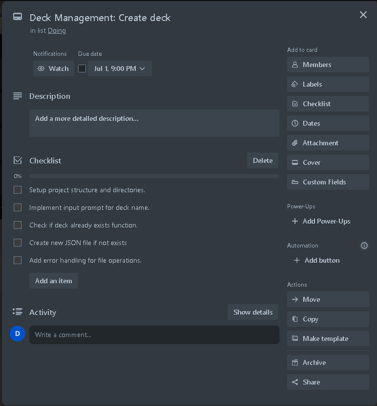

# T1A3-Terminal_application

Introduction
Terminal applications, also known as command line applications (or apps for short), are run from the shell and accept input from stdin and arguments such as flags and options, and produce an output that is useful to the user.

You will create your own terminal app because:
- terminal applications are an essential part of learning to utilise the functions of all operating systems efficiently and in a way that promotes your understanding of the inner workings and processes of operating systems and the hardware itself

- many applications used across IT functions utilise terminal applications as a standard, rather than applications with a graphical user interface;

- developing your own terminal application will increase your technical sophistication and ability to use other terminal applications.

Brief
- You are to design, implement and test a terminal application and throughout the process demonstrate that you are able to use a range of developer tools.

The mandatory requirements/constraints for your application are:
- accept user input in the form of a file or text input

- produce printed output or interact with the file system

- You must get your Educators approval for your app idea prior to working on the software development plan or implementing the application itself

Assessment Instructions
Requirements for this project are divided into two major parts,

1. DOCUMENTATION REQUIREMENTS
    - Documentation for this project must be supplied as a single markdown file named README.md. This file should contain:

# R1

Answers to all the documentation requirements below.

# R2

Your README.md should have a separate heading for each documentation requirement and answers organised under the appropriate headings.

# R3

Provide full attribution to referenced sources (where applicable).

# R4

Provide a link to your source control repository

- Repository link: https://github.com/LukeZHar/T1A3-Terminal_application

# R5

Identify any code style guide or styling conventions that the application will adhere to.

Reference the chosen style guide appropriately.

- Code Style PEP 8 - Style guide for Python Code
    - Reference website: https://peps.python.org/pep-0008/

# R6

Develop a list of features that will be included in the application. It must include:

- at least THREE features

- describe each feature, providing a walkthrough of the logic of the application.

Note: Ensure that your features above allow you to demonstrate your understanding of the following language elements and concepts:

- use of variables and the concept of variable scope

- loops and conditional control structures

- error handling

Consult with your educator to check your features are sufficient .

## Features and Functions
### Deck Management
#### Create Deck:  
- Description: Create a new deck. Input the deck name, verified to avoid duplicates, and then saves as a new JSON file.

- Logic: 
    - Prompts for a deck name.
    - Check if the deck name already exists.
    - If it does not exist, create a new JSON file for the deck.
    - If it does exist, asks for a different name.

#### Delete Deck:  
- Description: Delete an existing deck by specifying its name.

- Logic:
    - Prompts for the deck name.
    - Check if the deck exists in the directory.
    - If it exists, delete the JSON file.
    - If it does not exist, prompts name doesnt exist.

#### Select Deck
- Description: Select a deck to perform operations.

- Logic:
    - List all available decks.
    - Prompt to choose a deck by number.
    - Validates input and sets the current deck.

#### List Decks:
- Description: Helper function to list all decks.

- Logic:
    - Retrieve all JSON files from the decks directory.
    - Display the names of the decks (without the .json extension).

### Flashcard Creation
- Description: Add new flashcards to the selected deck by providing a question and an answer.

- Logic:
    - Prompts for a question and an answer.
    - Load the current deck from its JSON file.
    - Append the new flashcard to the deck.
    - Save the updated deck back to the JSON file.

### Quiz Mode
- Description: Shuffles flashcards then quizzes you, keeping track of correct and incorrect responses.

- Logic:
    - Load the selected deck.
    - Shuffle the order of flashcards.
    - Loop through each flashcard, prompting the user for an answer.
    - Track correct and incorrect answers.
    - Display the quiz score at the end.

### Scoring
- Description: Tracks the number of correct and incorrect answers during the quiz for the user to see their progress.

- Logic:
    - Maintain counters for correct and incorrect answers.
    - Update counters based on user’s responses during the quiz.

### Review
- Description: After completing a quiz session, you can review your answers and see where you need to improve.

- Logic:
    - Store each question, input, and correct answer during the quiz.
    - After the quiz, display all these results for review.

 
### Save and Load
- Description: Save flashcards and decks in JSON files to load them later.

- Logic:
    - Save: Convert the deck list to JSON format and write it to a file.
    - Load: Read the JSON file, parse it, and return the deck list.

# R7

Develop an implementation plan which:
- outlines how each feature will be implemented and a checklist of tasks for each feature
- prioritise the implementation of different features, or checklist items within a feature
- provide a deadline, duration or other time indicator for each feature or checklist/checklist-item

Utilise a suitable project management platform to track this implementation plan.

Provide screenshots/images and/or a reference to an accessible project management platform used to track this implementation plan. 

Your checklists for each feature should have at least 5 items.

## Implementation Plan
### Deck Management
1.1 Create Deck
- Tasks:
    - Setup project structure and directories.
    - Implement input prompt for deck name.
    - Check if deck already exists function.
    - Create new JSON file if not exists.
    - Add error handling for file operations.
  
Deadline: 01/07/2024

1.2 Delete Deck
- Tasks:
    - Implement input prompt for deck name.
    - Check if deck file exists.
    - Delete the JSON file.
    - Add error handling for file operations.
    - Confirm deletion.

Deadline: 01/07/2024

1.3 Select Deck
- Tasks:
    - List all existing decks function.
    - Implement input prompt for selecting a deck.
    - Validate user input.
    - Set selected deck to current working deck.
    - Confirm selection.

Deadline: 01/07/2024

1.4 List Decks
- Tasks:
    - Implement function to list all JSON files in directory.
    - Format the output to exclude file extensions.
    - Enhance output readability.
    - Test listing with multiple decks.
    - Add error handling for directory read.

Deadline: 01/07/2024

### Flashcard Creation
2.1 Add Flashcard
- Tasks:
    - Implement input prompts for question and answer.
    - Load the selected deck from JSON file.
    - Append new flashcard to the deck.
    - Save updated deck back to JSON file.
    - Add error handling for file I/O operations.

Deadline: 02/07/2024

### Quiz
3.1 Implement Quiz
- Tasks:
    - Load the selected deck from JSON file.
    - Shuffle the order of flashcards.
    - Implement loop to iterate through flashcards.
    - Prompt for answers and check.
    - Track correct and incorrect answers.

Deadline: 03/07/2024

3.2 Scoring
- Tasks:
    - Count correct and incorrect responses.
    - Display results at the end of the quiz.
    - Test scoring with different decks.
    - Handle edge cases (e.g., empty deck).
    - Add error handling for unexpected inputs.

Deadline: 03/07/2024

### Review Mode
4.1 Implement Review Mode
- Tasks:
    - Store input during the quiz.
    - Implement function to display inputs and correct answers.
    - Format the output for review clarity.
    - Allow navigation through reviewed questions.
    - Handle various review scenarios (all correct and incorrect inputs).

Deadline: 04/07/2024

### Save and Load
5.1 Save and Load Decks
- Tasks:
    - Implement function to save the deck to JSON.
    - Implement function to load the deck from JSON.
    - Ensure data integrity during save/load.
    - Add error handling for file I/O operations.
    - Test save/load with large decks.

Deadline: 05/07/2024

### Trello Screenshots

# R8

Design help documentation which includes a set of instructions which accurately describe how to use and install the application.

You must include:
- steps to install the application
- any dependencies required by the application to operate
- any system/hardware requirements
- how to use any command line arguments made for the application

2. CODE REQUIREMENTS:  

# R9

Implement features in the software development plan you have designed. You must utilise a range of programming concepts and structures using Python such as:

- variables and variable scope

- loops and conditional control structures

- write and utilise simple functions

- error handling

- input and output

- importing a Python package

- using functions from a Python package

# R10

Apply DRY (Don’t Repeat Yourself) coding principles to all code produced.

# R11

Apply all style and conventions for the programming language consistently to all code produced.

# R12

Creates an application which runs without error and has features that are consistent with the development plan.

# R13

Utilise source control throughout the development of the application by:

- making regular commits (at least 20 commits) with a commit message that summarises the changes

- pushing all commits to a remote repository

# R14

Utilise developer tools to facilitate the execution of the application:

For example,

- writing a script which turns the application into an executable

## marking guide

